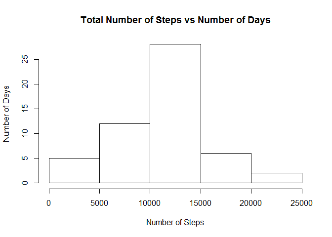
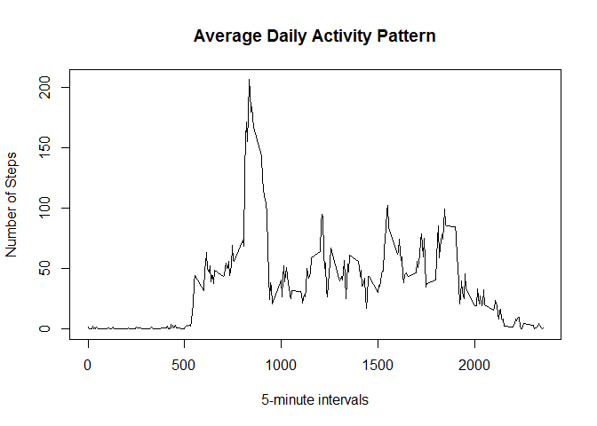
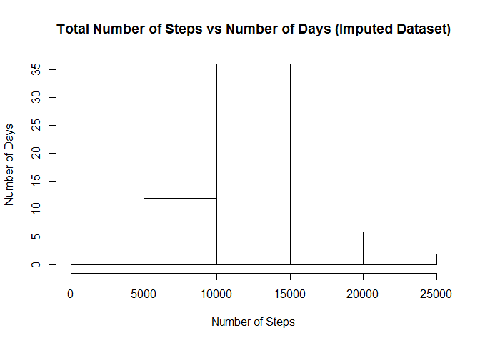
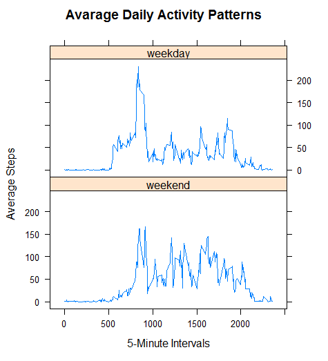

# Reproducible Research: Peer Assessment 1


## Loading and preprocessing the data

In this section,the data file is read into a data.frame called 'activity_data'. The "date" variable is formatted as DATE.


```r
work_dir = getwd()
data_file = file.path(work_dir, "activity.zip")

activity_data = read.csv(unz(data_file, "activity.csv"),
                         stringsAsFactors = FALSE)
activity_data[,"date"] = as.Date(activity_data[,"date"], "%Y-%m-%d") 
```

## What is mean total number of steps taken per day?

In this section, total number of steps taken per day is calculated first by grouping the data with the date variable and summing the steps in 5 minutes intervals. 


```r
sum_step_data = aggregate(steps ~ date, data = activity_data, FUN = sum) 
```

The histogram of the total number of steps is plotted below.


```r
hist(sum_step_data$steps, main = "Total Number of Steps vs Number of Days",
     xlab = "Number of Steps", ylab = "Number of Days")
```

<!-- -->

Mean and median of the total number of steps per day are calculated as follows:


```r
meanSteps = round(mean(sum_step_data$steps, na.rm = TRUE),1)
medianSteps = median(sum_step_data$steps, na.rm = TRUE)
```

The mean of the total number of steps per day is 10766.2 and the median is 10765.

## What is the average daily activity pattern?

In this section, average daily activity pattern will be determined by grouping the data with the interval variable and averaging the steps 


```r
mean_interval_steps = aggregate(steps ~ interval, data = activity_data, FUN = mean)
```

Time series plot if the 5-minute interval and the average number of steps averaged across all days is given below:


```r
plot(mean_interval_steps$interval, mean_interval_steps$steps, type = "l",
     main = "Average Daily Activity Pattern", xlab = "5-minute intervals",
     ylab = "Number of Steps")
lines(mean_interval_steps$interval, mean_interval_steps$steps)
```

<!-- -->

The 5-minute interval, on average across all the days in the dataset, which contains the maximum number of steps is calculated as follows:


```r
maxInterval = mean_interval_steps[which.max(mean_interval_steps$steps),"interval"]
```

The 5-minute interval with maximum number of steps is 835.

## Imputing missing values

There are a number of days/intervals where there are missing values. The number of missing values is 2304. To impute the missing values, mean value of the steps for the corresponding 5-minute interval is used. New dataset named `activity_data_imputed` with imputed missing values is obtained below:


```r
# Creating new dataset
activity_data_imputed = activity_data
# Adding mean interval steps to activity data as a new variable
interval_match = match(activity_data_imputed$interval,mean_interval_steps$interval)
activity_data_imputed$meanSteps = mean_interval_steps[interval_match,2]
# Changing NA values with the mean interval steps
na_steps = is.na(activity_data_imputed$steps)
activity_data_imputed$steps[na_steps] = activity_data_imputed$meanSteps[na_steps]
```

In this section, total number of steps taken per day is calculated for imputed dataset first by grouping the data with the date variable and summing the steps in 5 minutes intervals. 


```r
sum_step_data_imputed = aggregate(steps ~ date, data = activity_data_imputed,
                                  FUN = sum) 
```

The histogram of the total number of steps is plotted below.


```r
hist(sum_step_data_imputed$steps, main = "Total Number of Steps vs Number of Days (Imputed Dataset)",
     xlab = "Number of Steps", ylab = "Number of Days")
```

<!-- -->

Mean and median of the total number of steps per day are calculated as follows:


```r
meanStepsImputed = round(mean(sum_step_data_imputed$steps, na.rm = TRUE),1)
medianStepsImputed = median(sum_step_data_imputed$steps, na.rm = TRUE)
```

The mean of the total number of steps per day is 10766.2 and the median is 10766.19 for imputed dataset. The mean and median estimates are almost the same with the case when NA values are not included or not imputed. However, the number of days with total number of steps is around 10000 increased with imputed dataset. 

## Are there differences in activity patterns between weekdays and weekends?

In this section, activity patterns for weekdays and weekends are obtained respectively. For that purpose, a new factor variable `dayType` is added to the dataset which indicates whether a given date is a weekday or weekend day.


```r
# Creating a vector with weekend days only to seperate data
weekend = c("Saturday", "Sunday")
# Adding the new factor variable
activity_data_imputed$dayType =
  factor(weekdays(activity_data_imputed$date) %in% weekend, levels = c(TRUE, FALSE), labels = c("weekend", "weekday"))
```

Average daily activity patterns for weekdays and weekends will be determined by grouping the data with the interval variable and averaging the steps.


```r
mean_interval_steps_dayType = aggregate(steps ~ interval + dayType,
                                        data = activity_data_imputed, FUN = mean)
```

Time series plots if the 5-minute interval and the average number of steps averaged across weekend and weekdays are given below by using ggplot:


```r
library(lattice)
xyplot(steps ~ interval | factor(dayType), data = mean_interval_steps_dayType, layout = c(1,2),
       xlab = "5-Minute Intervals", ylab = "Average Steps", 
       main = "Avarage Daily Activity Patterns", type = "l", aspect = 1/2)
```

<!-- -->
